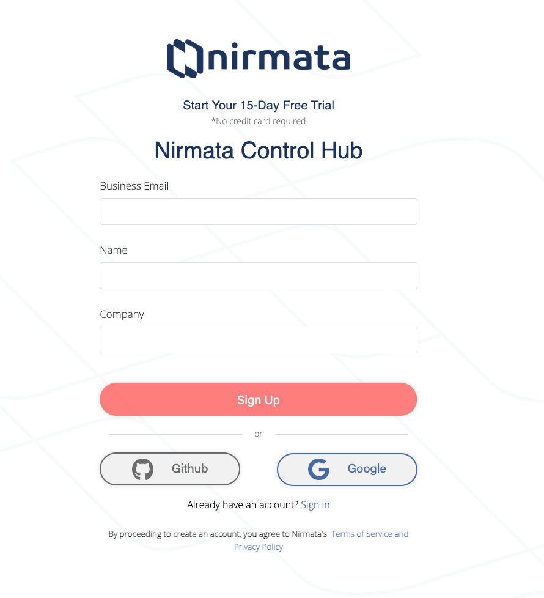
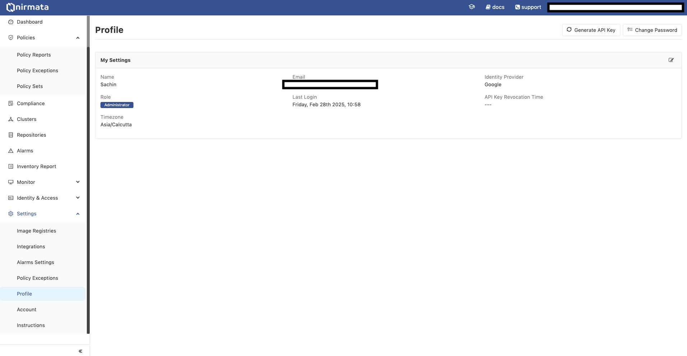

## Amazon EKS Fleet Management Workshop - Nirmata

**NOTE: This is a permanent fork of original [Amazon EKS Fleet Management Workshop - ReInvent KUB303](https://github.com/aws-samples/fleet-management-on-amazon-eks-workshop)**

## Changes from the original upstream

The goal of this version is to demonstrate integration with [Nirmata Control Hub](https://nirmata.com/nirmata-control-hub/) for policy-based security, governance, and compliance.

In this version of the project we have switched off the optional integrations with certain AWS services like managed prometheus, Security Hub, Cloudwatch Dashboards, Kyverno policy reporter and added new capabilities with the integration of Nirmata Control Hub via cluster registrator and Enterprise Kyverno (N4K).


## Learnings:

* Fleet Provisioning: Infrastructure as Code to deploy EKS clusters
* Fleet Management: GitOps to Kubernetes resources (helm addons)
* Fleet Governance: Policy across EKS clusters
* Fleet Governance Dashboard: Nirmata Control Hub for central visibility.

## Getting Started

Please follow the instructions given in the [fleet.md](./fleet.md) to run with your own AWS account.


## Use Cases

1. Deploy EKS clusters (hub, staging, prod)
1. Deploy Namespaces
1. Deploy Applications
1. Day 2 Operations

## Demo

Clone the repositort and cd to the base directory:

```sh
git clone https://github.com/nirmata/aws-eks-fleet-management; cd aws-eks-fleet-management
```
*** In case you are forking this repository to your organisation account then change the above URL accordingly

## Setup

1. Visit https://try.nirmata.io and signup using your company email ID.



2. Once signed up go to the My profile section and generate an API Key.



3. Keep this generated token handly for later.

4. Generate a github access token with readonly access to the repository. https://github.com/settings/tokens

5. Export following variables to your terminal:
``` sh
export TF_VAR_create_github_repos=false   # This variable if true will create github repositories from scratch and needs write permission
export TF_VAR_gitea_external_url=https://github.com # Version control URL
export TF_VAR_gitea_repo_prefix="$GITHUB_USERNAME_OR_ORG/"   # Set this variable to nirmata or your organisation name if you have forked this repository
export TF_VAR_gitea_user=$GITHUB_USERNAME   # Your username for which token was create in step 4
export TF_VAR_gitea_password=$GITHUB_TOKEN  # Github token created in step 4
export TF_VAR_nirmata_api_token=$NIRMATA_API_TOKEN # Nirmata API token created in step 2
export AWS_PROFILE=$PROFILE    # Set your AWS CLI Profile in case if you are using multiple AWS profile in your terminal
export AWS_REGION=$REGION      # Set the AWS Region where you want to deploy this infrastructure.
```
6. EKS Cluster Creation and Secret Setup

- For each fleet member, an EKS cluster is created using Infrastructure as Code (IaC) tools such as Terraform (TF), AWS Controllers for Kubernetes (ACK), or Cluster API (CAPI). to create the fleet member run deploy.sh file under ./terraform/spokes/
- The IaC process will create an AWS Secrets Manager key containing the cluster information for the Spoke cluster.
- The Hub cluster will be created with ArgoCD deployed via IaC, which is necessary to bootstrap the External Secrets Operator to prepare for the spoke registration process.
```sh
./terraform/common/deploy.sh
```
*** The above script will create following AWS reosurces `AWS secret manager secret keys`, `IAM roles` and `AWS SSM Parameter Store`.

7. Hub Cluster Initialization

- The Hub cluster is configured to wait for secrets from the Spoke clusters. Once these secrets are available, the registration process can begin.
- The Fleet control plane on the Hub cluster includes the following applications:
  - **Hub Secret Store**: Manages the external secrets required by the Hub cluster.
  - **Fleet Hub Secrets**: Utilizes the secrets created by the Spoke clusters to register these clusters with the Hub.
  - **Fleet Member Init**: Bootstraps the Spoke clusters and integrates them into the Fleet control plane.

```sh
./terraform/hub/deploy.sh
```

*** THe above script will create hub cluster and bootstrap the Hub cluster with the `gitops-bridge-addons` Helm chart.

8. Once the Hub Cluster is deployed you will be able to navigate to the argocd UI using the following commands:
```sh
# CONFIGURE ARGOCD
aws eks --region ${local.region} update-kubeconfig --name ${module.eks.cluster_name}
export ARGOCD_OPTS="--port-forward --port-forward-namespace argocd --grpc-web"
kubectl config set-context --current --namespace argocd
ARGOCD_PASSWORD=$(kubectl get secrets argocd-initial-admin-secret -n argocd --template="{{index .data.password | base64decode}}")
argocd login --port-forward --username admin --password $ARGOCD_PASSWORD
kubectl port-forward -n argocd svc/argocd-server 8080:80


# Access Argo CD
visit http://localhost:8080/
```
9. You will also be able to see that our Hub cluster gets automatically registered with the Nirmata Control Hub along with the PSS policies. Visit https://www.nirmata.io/security/ and login with your credentials.


10. Create a fleet cluster Infrastructure:
```sh
# Switch to different terminal session
./terraform/spokes/deploy.sh staging
```

*** The above script will select the workspace as staging and refer to the staging.tfvars for creating a staging cluster as spoke. As part of the deployment it will also create a secret in the AWS Secrets Manager with the name `fleet-hub-cluster/fleet-spoke-staging`

11. Once the Spoke Cluster is deployed you will be able to navigate to the argocd UI using the following commands:

```sh
# CONFIGURE ARGOCD
aws eks --region ${local.region} update-kubeconfig --name ${module.eks.cluster_name}
export ARGOCD_OPTS="--port-forward --port-forward-namespace argocd --grpc-web"
kubectl config set-context --current --namespace argocd
ARGOCD_PASSWORD=$(kubectl get secrets argocd-initial-admin-secret -n argocd --template="{{index .data.password | base64decode}}")
argocd login --port-forward --username admin --password $ARGOCD_PASSWORD
kubectl port-forward -n argocd svc/argocd-server 8000:80


# Access Argo CD
visit http://localhost:8000/
```

12. Register the spoke cluster with hub cluster:
- In the Fleet directory , under the `members` directory, create a new folder named after the fleet member (e.g., `fleet_member_name`).
- Inside this folder, add a `values.yaml` file containing:
  - The name of the AWS Secrets Manager key with the Spoke cluster information.
  - The name of the fleet cluster.

```sh
cd ./gitops/fleet/members

# uncomment the content in fleet-spoke-staging/values.yaml and save the changes.

# commit the changes in the repository and push it to the branch.

# In case you want to add another spoke just create a folder inside the members with the name <ClusterName>/values.yaml

# Add the following content

# tenant: "tenant1"
# environment: "<Environment>"
# clusterName: "ClusterName"
# secretManagerSecretName: "fleet-hub-cluster/<ClusterName>"

```

13. Triggering the ApplicationSet and Secret Creation:

- Adding this folder will trigger the ArgoCD generator to:
  - Automatically create a new secret that registers the Spoke cluster with the Hub.
  - Create a new member in the Fleet Member Init, which will deploy ArgoCD and the External Secrets Operator to the Spoke cluster. This will also include the deployment of fleet member manifests that contain the GitOps Bridge Helm chart or any other resources needed by the Spoke clusters, as defined in the `members-manifest` folder.

14. After this, all subsequent applications are deployed by the ArgoCD instance on the Spoke cluster, not the one on the Hub. However, all the information about the repositories it needs to connect to will be sourced from the Hub cluster.

15. Navigate to https://www.nirmata.io/security/ and check in the cluster section where you will find your spoke cluster also got registered with Nirmata Control Hub along with the PSS Policies.


## CleanUp

```sh

./terraform/hub/destroy.sh
./terraform/spokes/destroy.sh staging
./terraform/common/destroy.sh
```

## Security

See [CONTRIBUTING](CONTRIBUTING.md#security-issue-notifications) for more information.

## License

This library is licensed under the MIT-0 License. See the LICENSE file.
